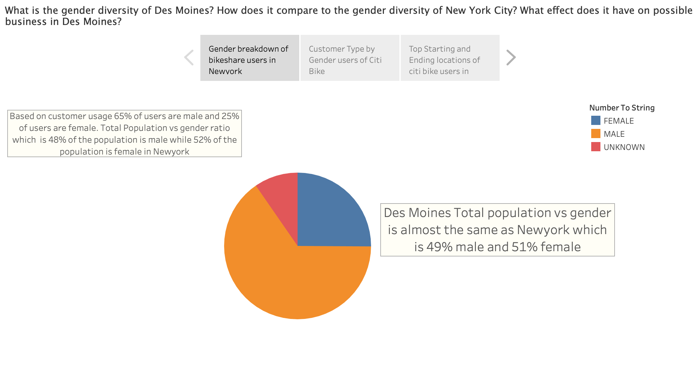
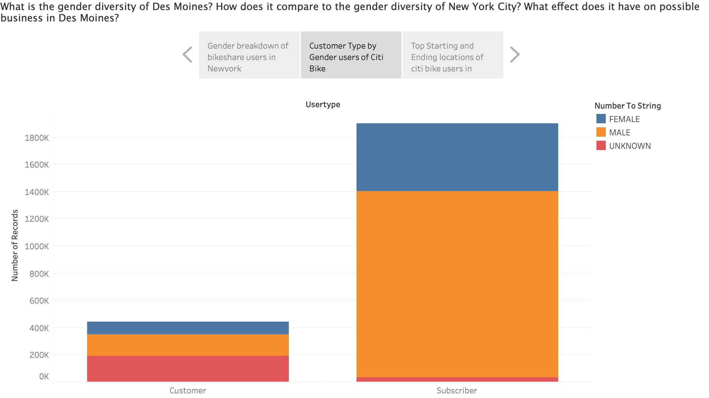
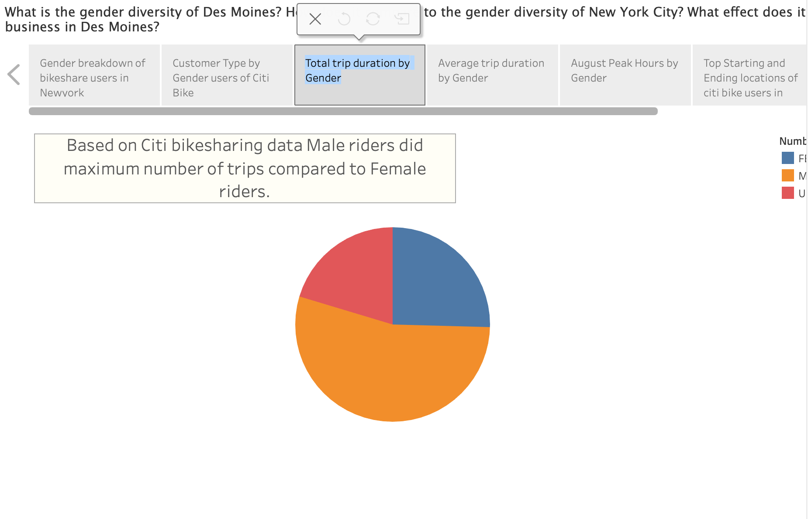
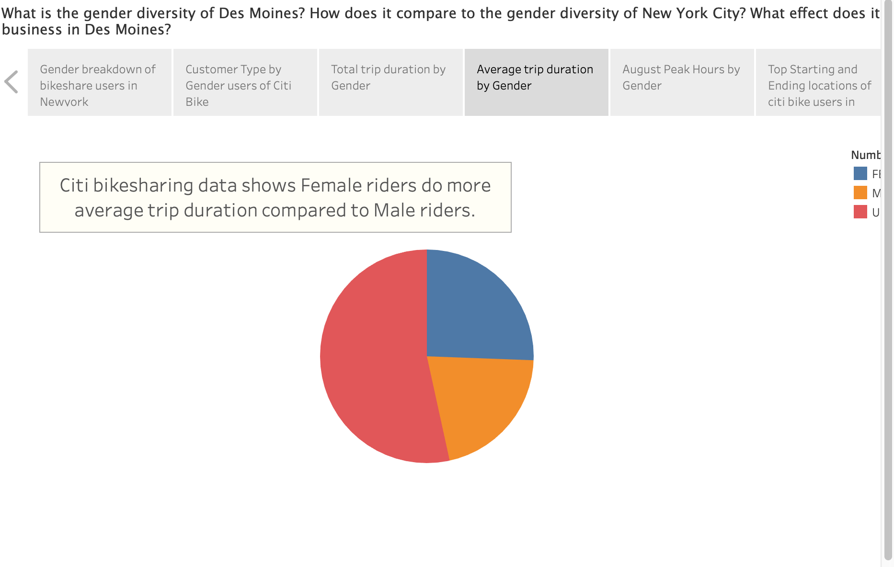
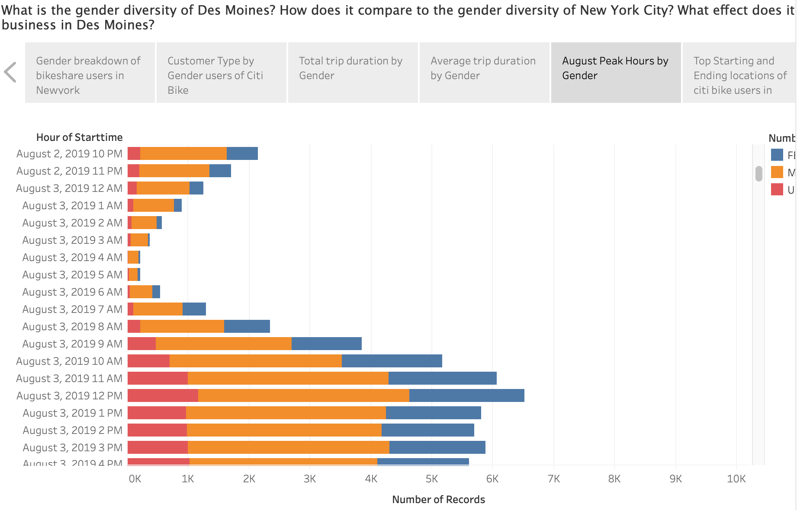
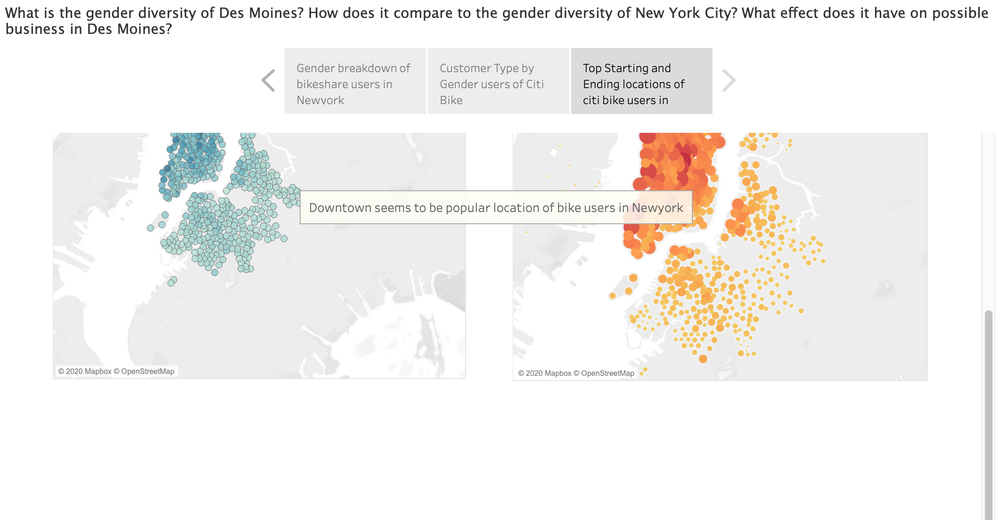

# Analysis for starting Bikeshare business in Des Moines

   Analysis mainly deals with why is it a good idea to start a bikeshare business in Des Moines based on the data from Citi Bikeshare Newyork. It compares some of the similarities between Newyork City and Des Moines and also helps to see the value in using these data to help make the investment decision for this new business in Des Moines Iowa. For this analysis we have used public data from Citi Bikeshare Newyork. 

## Overview

   We have created a Tableau Story to compare the similarities between the two cities before diving into the recommendations.

### Tableau Story (Des Moines Bikesharing idea):

#### Gender breakdown of bikeshare users in Newyork:
    
   To start a business in Des Moines, Iowa it would be good idea to look at the population and the gender diversity of the city. Looking at the data of Des Moines during 2018 official report number of total population was 216,853 out of which close to 49% is Male and 51% is Female, comparing the same with Newyork report numbers from Citi Bikeshare is 48% Male and 52% Female. This gives an rough idea that similar gender diverisity between two cities.

#### Customer Type by Gender users of Citi Bike:

   Looking at Citi Bikeshare's Customer and Subscribers data using the gender data it turns out the majority of the users of the citi bikeshare is Male. Subscribers data might elude us towards either locals or domestic tourists while the customers might be international tourists. Based on 2018 toursit data released from Newyork, it had 51 Million domestic tourist and 13 Million International tourists. Iowa's tourism seems to be booming based on 2016 data they had 13 Million Tourist.

### Total and Average trip duration by Gender:

    Closely looking at the data we could see Male riders did most of number of trips compared to Female riders. But Female riders average trip duration seems to be much more than the Male riders. 

### August Peak Hours by Gender:

    Looking at August one of the busy months in Summer, peak usage data shows the busiest times are from 8 in the morning till 8 in the evening. Also data shows there were more Male riders than the Female riders.

#### Top Starting and Ending locations of citi bike users in Newyork:

   Looking at the bike users data it seems dowtown seems to be popular location for both starting and ending locations. Seems people tend to ride bike in the downtown area to visit tourist spots or restaurants or for other activities. In the recent years Des Moines downtown has been more vibrant and popular tourist attraction with sports and other events during the summer months to attract domestic tourist.

#### Details about Des Moines supporting the idea:

    Please find the link to Story which supports the idea of starting a bikeshare business in Des Moines Iowa. [Link to Story](https://public.tableau.com/profile/ayyappa.muthusami#!/vizhome/DesMoinesBikesharebusinessidea/DesMoinesBikesharingidea?publish=yes)
    
#### Recommendations:

   Based on gender diversity and tourist data during summer months, both newyork and de moines seems to be popular destination for both local and domestic tourist. In the recent years Iowa seems to be catching with improving the facilities to attract tourists during summer months with vibrant downtown, event and activities. So starting bikeshare business like Citi bikeshare in Des Moines would be good idea to tap in both local and domestic tourist market. 

